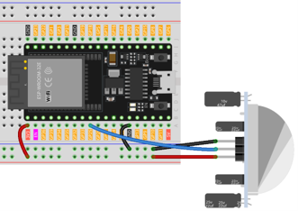
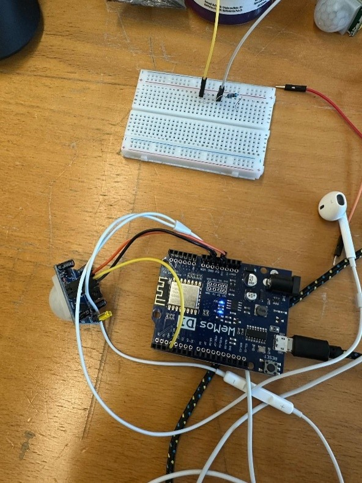
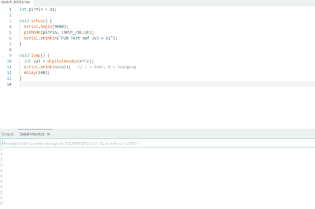
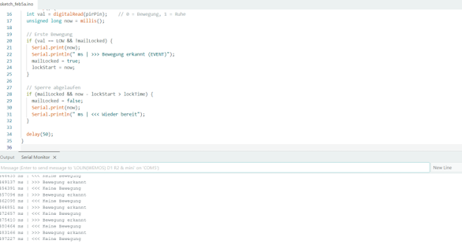
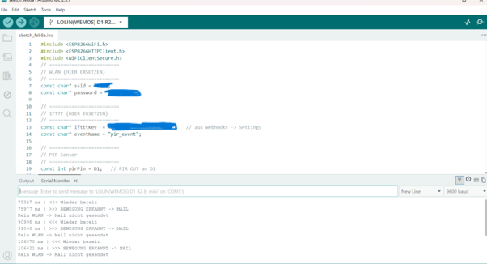
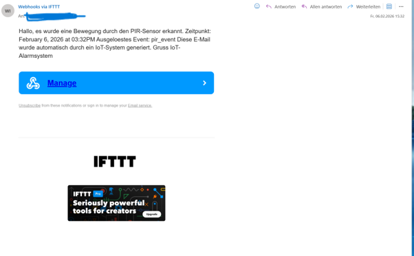

# ESP8266 Motion Alert

## Overview

This project implements an IoT-based motion detection and notification system using an ESP8266 microcontroller and a PIR motion sensor.

When motion is detected for a defined period of time, the ESP8266 triggers an IFTTT event and sends an email notification. A lock mechanism prevents multiple notifications from being triggered repeatedly for the same motion event.

## Project Goal

The goal of the project was to build a simple IoT security and monitoring system that combines physical sensor input, microcontroller programming and a cloud-based notification service.

The system demonstrates the complete workflow from motion detection to an automated email notification.

## Hardware

- ESP8266
- PIR motion sensor
- Breadboard
- Jumper wires
- USB power connection

## Software & Services

- Arduino IDE
- ESP8266 Arduino libraries
- IFTTT Webhooks
- Email notification service
- Wi-Fi network

## System Workflow

The system follows this processing sequence:

1. The PIR sensor monitors the environment for movement.
2. The ESP8266 reads the digital sensor signal.
3. The system validates the detected movement.
4. The ESP8266 triggers an IFTTT webhook.
5. IFTTT processes the event.
6. An email notification is sent.
7. A temporary event lock prevents duplicate notifications.

## Hardware Setup

The PIR sensor is connected to the ESP8266 using three main connections:

- VCC → 3.3 V
- GND → GND
- OUT → D1

### Wiring Diagram



### Physical Hardware Setup



## Programming

The ESP8266 was programmed using the Arduino IDE.

The program continuously reads the PIR sensor signal and processes the detected movement before triggering further actions.



## Motion Detection Logic

The software monitors the PIR sensor and uses timing logic to distinguish relevant motion events from short signal changes.

After a valid event is detected, an event lock is activated. This prevents multiple email notifications from being triggered continuously while movement is still present.

The system becomes ready again after the configured lock and quiet periods have expired.

### Serial Monitor Test



## IFTTT Integration

IFTTT is used as the cloud-based automation service between the ESP8266 and the email notification system.

The ESP8266 sends an HTTPS request to an IFTTT webhook when a valid motion event is detected.

The configured IFTTT applet then processes the event and triggers the email notification.

### IFTTT Connection


## Testing

The complete processing chain was tested:

**Motion → PIR Sensor → ESP8266 → Wi-Fi → IFTTT → Email Notification**

Testing included:

- PIR sensor signal detection
- motion-event processing
- event-lock functionality
- Wi-Fi communication
- IFTTT webhook triggering
- successful email notification

### Motion Detection

The Serial Monitor shows the system detecting movement and attempting to trigger the notification workflow.



### Email Notification

The final test confirmed that a detected motion event could successfully trigger an automated email notification through IFTTT.



## Source Code

The Arduino source code is available here:

[`src/motion_alert.ino`](src/motion_alert.ino)

Sensitive information such as Wi-Fi credentials and the IFTTT authentication key has been replaced with placeholders in the public source code.

## Repository Structure

```text
esp8266-motion-alert/
├── docs/
│   └── screenshots/
│       ├── 01-wiring-diagram.png
│       ├── 02-hardware-setup.jpg
│       ├── 03-arduino-code.png
│       ├── 04-pir-serial-monitor.png
│       ├── 05-ifttt-connection.png
│       ├── 06-motion-detection.png
│       └── 07-email-notification.png
│
├── src/
│   └── motion_alert.ino
│
└── README.md
```

## Security

Sensitive credentials must not be stored in a public repository.

The public version of the source code therefore uses placeholders for:

- Wi-Fi SSID
- Wi-Fi password
- IFTTT Webhook key

This allows the project implementation to remain publicly documented without exposing authentication information.
